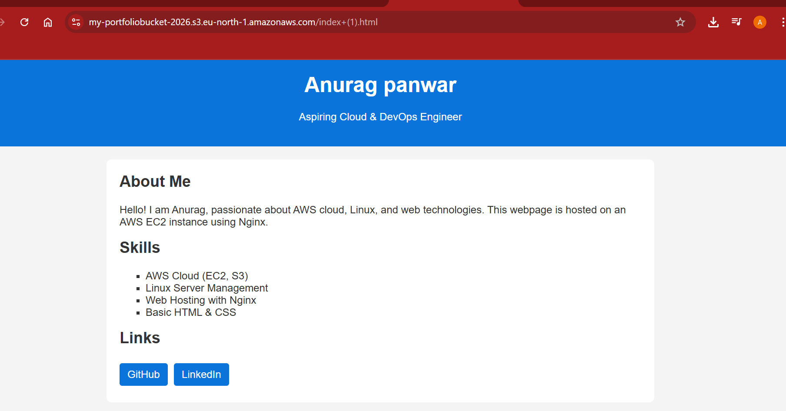

# Project 1 — Static Website Hosting on EC2
## 📸 Project Demo
## 🌐 Live Demo

http://<## 🌐 Live Demo

http://13.60.205.126

## 🚀 Overview
This project demonstrates how to deploy a static website on a cloud server using AWS EC2. It focuses on foundational cloud concepts and Linux server management.

## 🧱 Architecture
User → EC2 Instance → Nginx Web Server

## 🛠️ Technologies Used
- AWS EC2
- Linux (Ubuntu)
- Nginx
- SSH

## ⚙️ Implementation Steps
1. Created an EC2 instance on AWS
2. Connected to the instance using SSH
3. Installed and configured Nginx
4. Deployed a static HTML webpage
5. Configured security group to allow HTTP traffic

## ✨ Features
- Publicly accessible website
- Linux server configuration
- Web server setup

## 📌 Learning Outcomes
- Understanding cloud computing basics
- Working with Linux commands
- Managing remote servers using SSH
